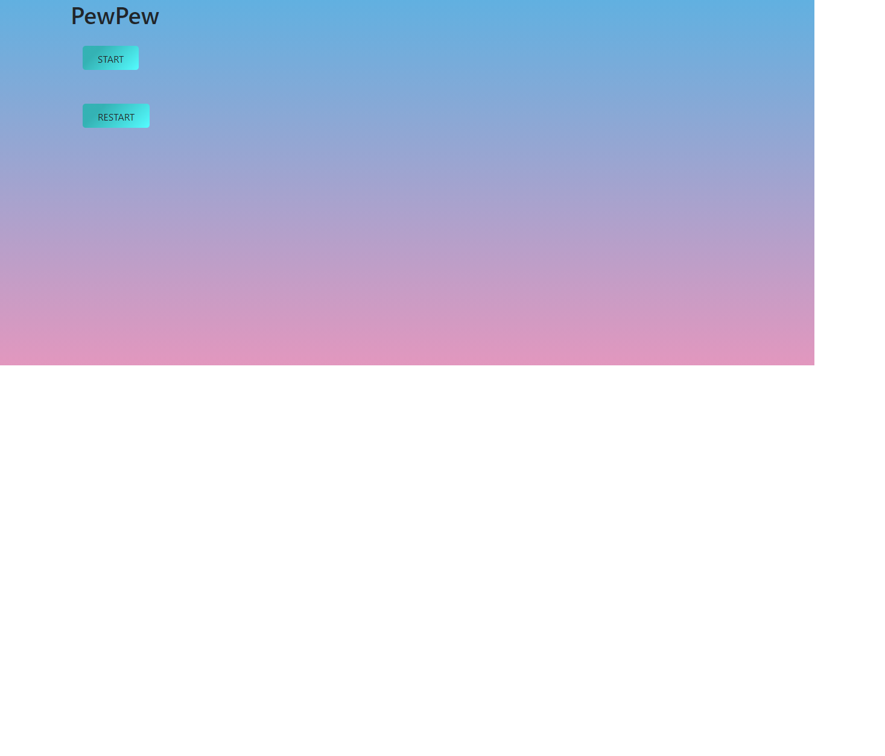

# PewPew

Réalisation d'un projet solo dans le cadre de la formation Web dév chez @becodeorg visant a réaliser un PewPew.

## Auteurs
* **evrardsibo** _alias_ [@evrardsibo](https://github.com/evrardsibo)

